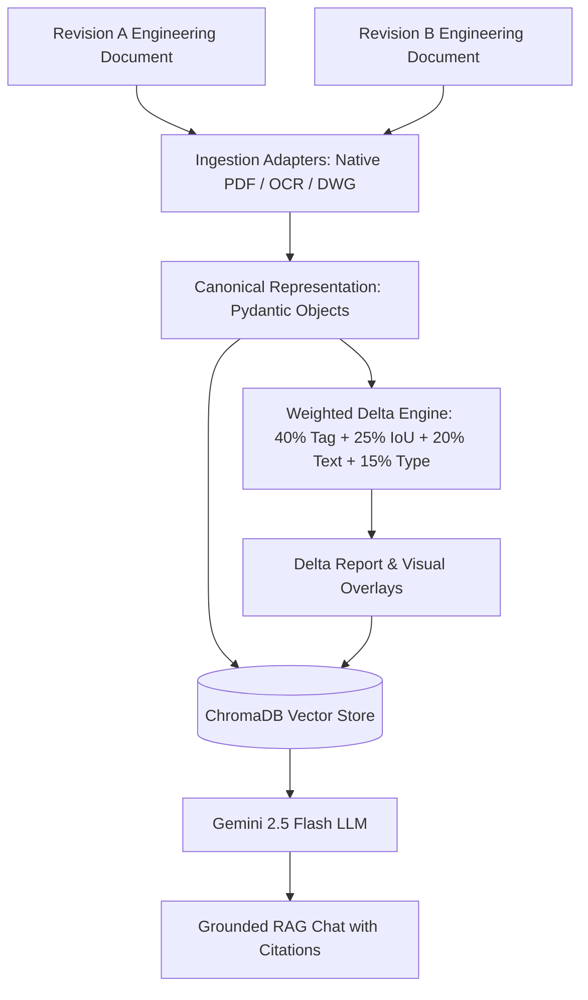

# DeltaDoc AI

[](https://www.python.org/)
[](https://fastapi.tiangolo.com/)
[](https://react.dev/)
[](https://www.trychroma.com/)
[](https://ai.google.dev/)
[](https://www.docker.com/)
[](https://opensource.org/licenses/MIT)

> **AI-powered engineering document comparison with delta analysis, grounded RAG chat, OCR, and visual diff generation.**

DeltaDoc AI is a production-oriented Applied AI engineering platform designed to ingest, parse, compare, and analyze engineering documents (Native PDFs, Scanned PDFs, and DWG drawings). It computes granular differences using a multi-factor weighted scoring engine, renders visual bounding-box diff overlays, generates structured Delta Reports with AI-generated Change Summaries, and indexes revisions in ChromaDB for grounded RAG chat with Gemini 2.5 Flash.

---

## 🎨 Key Features

- **Format-Agnostic Adapter Ingestion:**
  - `NativePDFAdapter`: Layout and text parsing using `pdfplumber` and PyMuPDF.
  - `ScannedPDFAdapter`: Optical Character Recognition (OCR) via PyMuPDF image rendering + `EasyOCR`.
  - `DWGAdapter`: CAD layer, entity, and block parsing stub.
- **Rich Canonical Representation:**
  - Normalizes every object to a common schema (`id`, `type`, `tag`, `page`, `bbox`, `rotation`, `layer`, `confidence`, `metadata`).
- **Weighted Scoring Matcher:**
  - $Score = 0.40 \cdot \text{TagMatch} + 0.25 \cdot \text{Spatial IoU} + 0.20 \cdot \text{TextSim} + 0.15 \cdot \text{TypeSim}$.
- **Visual Diff Engine:**
  - Highlights added elements in **Green**, removed elements in **Red**, and modified elements in **Yellow**.
- **AI-generated Change Summary:**
  - Automatically synthesizes high-level revision insights (e.g., total changes, valves removed, pressure updates).
- **Grounded RAG Chat with Citations:**
  - Vector indexing in ChromaDB using local SentenceTransformers (`all-MiniLM-L6-v2`) and Gemini 2.5 Flash (with OpenAI swappability). Enforces citations (e.g., `[Revision A, Page 1]`).
- **Unified JSON Telemetry & Tracing:**
  - End-to-end trace per request measuring OCR, embedding, retrieval, and LLM latencies, token counters, and cost estimation.
- **Evaluation Framework:**
  - Computes Delta Precision, Recall, F1, Groundedness Score, Hallucination Rate, Citation Accuracy, and Recall@k.

---

## 🏗️ Architecture Diagram



---

## 📁 Repository Structure

```
DeltaDocAI/
├── Dockerfile
├── docker-compose.yml
├── Makefile
├── requirements.txt
├── .env.example
├── LICENSE
├── README.md
├── main.py
├── src/
│   ├── ingest/             # PDF, OCR, DWG adapters & Canonical model
│   ├── delta/              # Weighted Matcher, Comparator & Report Generators
│   ├── visualization/      # Visual Diff image & PDF overlays
│   ├── rag/                # ChromaDB Vector Store, Embeddings & Grounded Chat
│   ├── pipeline/           # End-to-end Pipeline Orchestrator
│   ├── api/                # FastAPI routes, schemas & DI containers
│   ├── observability/      # Loguru JSON logger & Pipeline Tracer
│   └── eval/               # Evaluation Scorecard & Golden Dataset
├── tests/                  # Pytest unit & integration test suite
└── frontend/               # React + Vite + TypeScript + Tailwind Dashboard
```

---

## 🚀 Quickstart & Running

### 1. Local Environment Setup

```bash
# Clone repository
git clone https://github.com/piyushxbhardwaj/DeltaDocAI.git
cd DeltaDocAI

# Create virtual environment & install backend dependencies
python -m venv venv
source venv/bin/activate  # On Windows: venv\Scripts\activate
pip install -r requirements.txt

# Set up environment variables
cp .env.example .env
```

### 2. Run Backend REST API

```bash
python main.py
# Server running at http://localhost:8000
# OpenAPI Docs: http://localhost:8000/docs
```

### 3. Run Frontend Dashboard

```bash
cd frontend
npm install
npm run dev
# Dashboard accessible at http://localhost:3000
```

---

## 🐳 Docker Deployment

Start the entire production stack (Backend + Vector Database + Frontend) with a single command:

```bash
docker compose up --build -d
```

---

## 🧪 Evaluation Framework

Execute the quantitative benchmark suite via `make` or directly in Python:

```bash
make eval
# Or directly via python:
python -c "import asyncio; from src.api.dependencies import get_chat_engine; from src.eval.metrics import EvaluationSuite; print(asyncio.run(EvaluationSuite.run_full_evaluation([], get_chat_engine(), 'eval-session')))"
```

### Baseline Benchmark Targets
- **Delta Detection Precision:** ~0.95+
- **Delta Detection Recall:** ~0.95+
- **Delta Detection F1 Score:** ~0.95+
- **RAG Groundedness Score:** ~0.90+
- **Citation Accuracy:** ~0.95+
- **Retrieval Recall@k:** ~0.95+

---

## ⚖️ Engineering Trade-offs & Design Decisions

- **Canonical Intermediate Representation:** Decouples document format parsing (Native PDF, Scanned PDF, DWG) from downstream matching and RAG reasoning. Any new format adapter only needs to target the `CanonicalObject` schema.
- **Weighted Semantic Matching vs. Pixel Diff:** Pixel comparison engines fail when elements shift or reflow. DeltaDoc AI combines Tag match (40%), Spatial IoU overlap (25%), Text string distance (20%), and Element classification (15%) for robust delta detection.
- **Decoupled LLM & Retriever Interfaces:** `BaseLLM` and `BaseRetriever` abstract provider dependencies, allowing zero-friction swapping between Gemini 2.5 Flash, OpenAI, or managed vector databases (Pinecone / Qdrant).
- **Decoupled Visual Overlay Markup:** Visual diff overlays operate independently on canonical coordinates without coupling image rendering to the core delta comparator logic.

---

## ⚠️ Current Limitations

- **DWG Support Scope:** DWG support currently demonstrates the format-agnostic adapter pattern via synthetic CAD entity parsing. Production deployment for native binary `.dwg` files requires an external CAD engine (e.g., `ezdxf` or Autodesk Forge API).
- **OCR Scan Quality Dependency:** Scanned PDF extraction accuracy relies on image DPI and scan clarity. Low-resolution scans may require pre-processing (binarization/deskewing).
- **Large Engineering Packages:** Multi-page PDF packages (50+ pages) should be processed asynchronously using a background task worker queue (e.g., Celery / Redis).
- **Evaluation Dataset Scale:** The included evaluation harness runs against a golden dataset designed for pipeline validation. Benchmarks should be expanded with larger domain-specific P&ID datasets for enterprise deployment.

---

## 📊 Assignment Requirement Coverage

- ✅ **Format-Agnostic Ingestion (Native PDF, Scanned PDF, DWG Stub)**
- ✅ **Canonical Intermediate Representation**
- ✅ **Weighted Scoring Delta Engine**
- ✅ **Structured Delta Report (JSON / Markdown / HTML)**
- ✅ **Grounded RAG Chat with Mandatory Citations**
- ✅ **Visual Diff Overlay Bounding Box Markup (Bonus Feature)**
- ✅ **Structured Telemetry & JSON Observability Tracing**
- ✅ **Quantitative AI Evaluation Framework**
- ✅ **FastAPI Backend REST APIs**
- ✅ **React TypeScript Tailwind Frontend Dashboard**
- ✅ **Docker Containerization & GitHub Actions CI**

---

## 📜 License

Distributed under the MIT License. See [`LICENSE`](LICENSE) for details.
